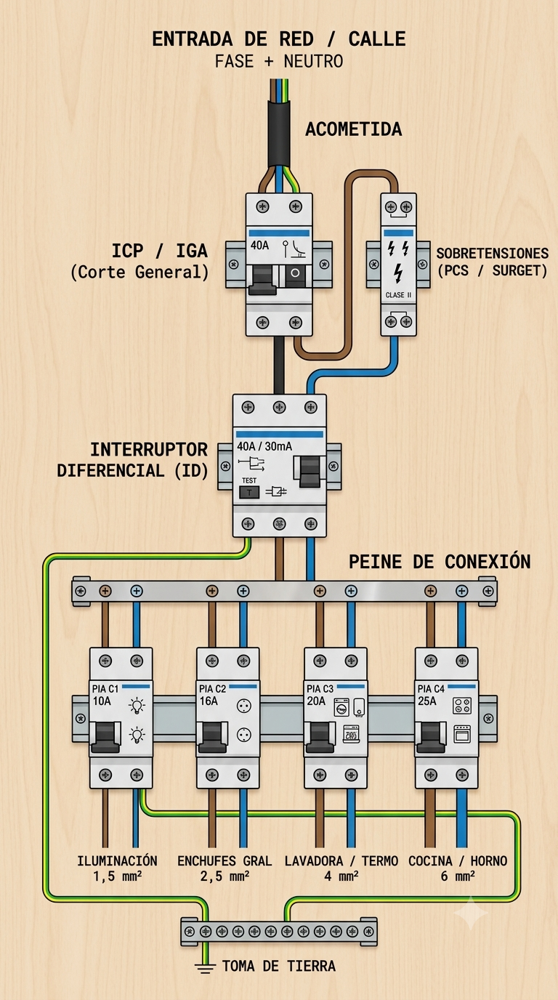
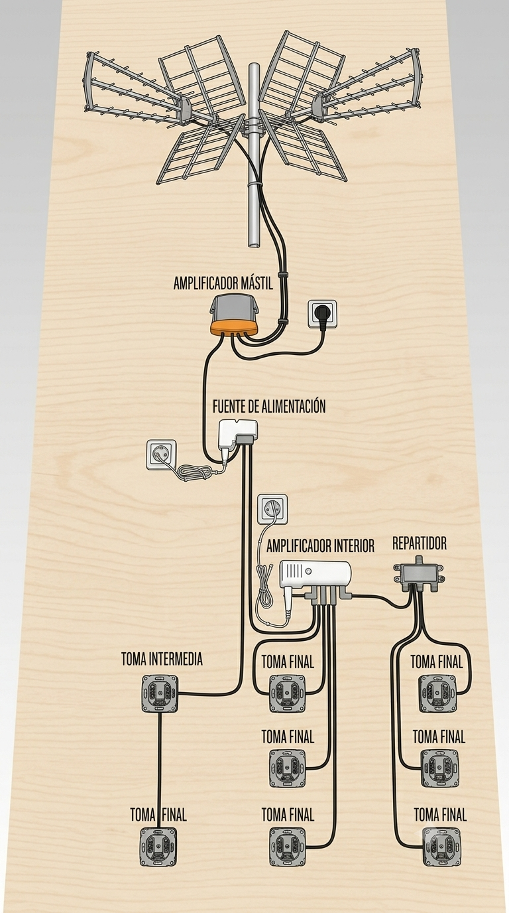
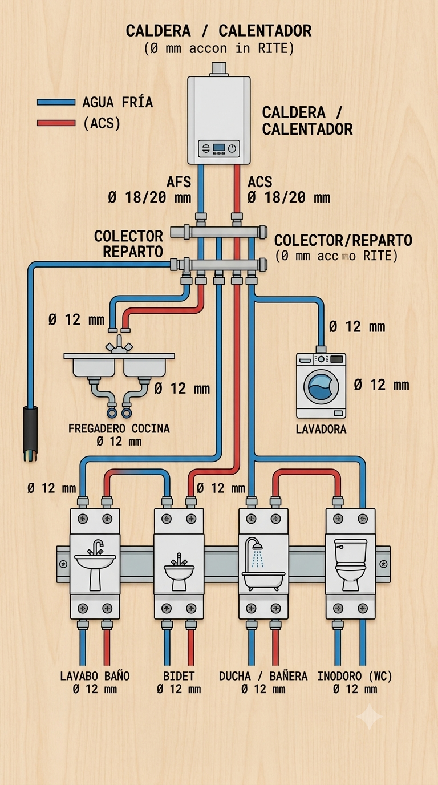

# Manual de Conceptos Básicos de Electricidad y Protección Antenas y fontaneria .

## 1. Componentes del Cuadro General de Mando y Protección (CGMP)

El cuadro eléctrico organiza la distribución y protección de las líneas de la vivienda:

* **ICP (Interruptor de Control de Potencia):** Controla que no se supere la potencia contratada con la compañía eléctrica.
* **IGA (Interruptor General Automático):** Protege la instalación contra cortocircuitos y sobrecargas generales. Corta la corriente si se supera la capacidad máxima de la línea.
* **PCS / SURGET (Protector de Sobretensiones):** Protege los equipos electrónicos contra picos de tensión (por ejemplo, impactos de rayos o fallos en la red).
* **ID (Interruptor Diferencial):** Protege a las personas frente a contactos directos e indirectos. Salta cuando detecta una fuga de corriente a tierra.
* **PIA (Pequeños Interruptores Automáticos):** Protegen cada circuito individual de la casa (iluminación, enchufes, electrodomésticos, etc.) frente a sobrecargas y cortocircuitos.

---

## 2. Tipos de Corriente

* **Corriente Alterna (AC):**
  * Es la que llega a las viviendas y comercios.
  * Cambia de sentido y polaridad periódicamente.
  * Permite transportar la energía a grandes distancias con menores pérdidas.
* **Corriente Continua (DC):**
  * Es el tipo de corriente que generan los **paneles solares fotovoltaicos** y las baterías.
  * Fluye siempre en el mismo sentido con polaridad constante.
  * Para consumirse en la vivienda, requiere de un **inversor** que la transforme de DC a AC.

---

## 3. Dimensionamiento de Cableado por Circuito

Sección de conductor de cobre según el uso normalizado:

| Circuito | Uso / Aplicación | Sección Mínima |
| :--- | :--- | :--- |
| **C1** | Iluminación | 1,5 mm² |
| **C2** | Tomas de uso general y frigorífico | 2,5 mm² |
| **C3** | Lavadora, lavavajillas y termo eléctrico | 4 mm² |
| **C4** | Cocina y horno | 6 mm² |
| **C5** | Tomas de corriente de baño y cocina | 2,5 mm² |

---

> **Nota:** La sección adecuada del cable garantiza evitar calentamientos en la línea y pérdidas de tensión innecesarias.
> ---

## 4. Tipos de Magnetotérmicos (PIAs) y Características

Los Pequeños Interruptores Automáticos (PIAs) protegen las líneas individuales frente a sobrecargas y cortocircuitos:

* **Corte Bipolar (1P+N / 2P):** Cortan tanto la **Fase** como el **Neutro**. Es la norma estándar en instalaciones residenciales para garantizar la seguridad total al maniobrar o ante un fallo en el circuito.
* **Curva de Disparo tipo C:** Es el estándar en viviendas. Salta rápido ante cortocircuitos pero tolera pequeños picos de arranque habituales en electrodomésticos comunes.

---

## 5. Tipos de Interruptores Diferenciales (ID)

Protegen a las personas frente a fugas de corriente a tierra. La sensibilidad habitual en viviendas es de **30 mA**:

* **Clase AC (Estándar):** Detecta fugas de corriente alterna puras. Apto para circuitos básicos de iluminación y cargas simples.
* **Clase A / Superinmunizado (SI):**
  * **¿Por qué usarlo?:** Los electrodomésticos modernos con electrónica avanzada, variadores de frecuencia, placas de inducción, aires acondicionados e inversores solares generan armónicos y corrientes continuas pulsantes que pueden hacer saltar un diferencial normal (disparos intempestivos).
  * **Ventaja:** Evita saltos en falso causados por ruido de la red o interferencias electrónicas y garantiza protección real ante fugas con componente continua.

---

## 6. Potencias Contratadas Habituales y Calibre Principal (IGA)

Relación orientativa entre la potencia contratada de la vivienda, la corriente máxima aproximada y el IGA recomendado:

| Potencia Contratada (Monofásica 230V) | Calibre del IGA Recomendado | Uso habitual |
| :--- | :--- | :--- |
| **3,45 kW** | 16 A | Viviendas pequeñas con equipamiento básico / gas |
| **4,6 kW** | 20 A | Vivienda estándar con vitrocerámica y aire acondicionado |
| **5,75 kW** | 25 A | Vivienda equipada / termo eléctrico + climatización |
| **9,2 kW** | 40 A | Vivienda con elevado consumo eléctrico / aerotermia |

---

## 7. Código de Colores Normalizado para Cableado

* **Fase:** Marrón, Negro o Gris.
* **Neutro:** Azul claro.
* **Toma de Tierra:** Franjas Verde y Amarilla.

* ---

## 8. Cajas de Empotrar para Cuadros Eléctricos

Las cajas se eligen según **tres factores clave**:

* **Nº de Módulos (Ancho DIN):** Cada módulo mide 17,5 mm. Tamaños habituales: **4, 6, 8, 12, 18, 24, 36 módulos**.
  * *Recomendación:* Aconsejar siempre dejar un **20-30% de módulos libres** para futuras ampliaciones (aire acondicionado, paneles solares, cargador de coche).
* **Tipo de Pared:**
  * **Obra / Ladrillo:** Caja de plástico rígido liso para fijar con yeso/mortero.
  * **Pladur / Pared Hueca:** Lleva **garras metálicas/plásticas con tornillos** laterales para presionar la placa de cartón yeso.
* **Uso y Entorno:**
  * **IP40:** Uso estándar en interior de viviendas.
  * **IP65:** Estanqueidad alta contra agua y polvo (para exterior, garajes o trasteros).

---

## 9. Peines de Conexión (Puentes de Unión)

Pletinas de cobre aisladas que conectan varios magnetotérmicos en paralelo en la misma fila sin acumular cables:

* **Monofásicos (L+N):** Para cuadros de vivienda estándar (pasa Fase y Neutro en patillas alternadas).
* **Trifásicos (3P o 3P+N):** Para instalaciones comerciales o industriales trifásicas.
* Se eligen por número de módulos (ej: 12, 24 módulos) o en tiras recortables.

---

## 10. Magnetotérmicos: Simple (1P+N) vs. Doble (2P)

<table style="width: 100%; border-collapse: collapse; margin-top: 10px;">
  <thead>
    <tr style="background-color: #f2f2f2; text-align: left;">
      <th style="padding: 8px; border: 1px solid #ddd;">Tipo</th>
      <th style="padding: 8px; border: 1px solid #ddd;">¿Qué corta?</th>
      <th style="padding: 8px; border: 1px solid #ddd;">¿Qué detecta/protege?</th>
      <th style="padding: 8px; border: 1px solid #ddd;">Ancho</th>
      <th style="padding: 8px; border: 1px solid #ddd;">Uso Principal</th>
    </tr>
  </thead>
  <tbody>
    <tr>
      <td style="padding: 8px; border: 1px solid #ddd;"><strong>1P + N</strong> (Estándar Vivienda)</td>
      <td style="padding: 8px; border: 1px solid #ddd;">Corta <strong>Fase y Neutro</strong></td>
      <td style="padding: 8px; border: 1px solid #ddd;">Protege solo en la <strong>Fase</strong></td>
      <td style="padding: 8px; border: 1px solid #ddd;"><strong>1 Módulo</strong> (17,5 mm)</td>
      <td style="padding: 8px; border: 1px solid #ddd;">Cuadros de vivienda habituales (ahorra espacio).</td>
    </tr>
    <tr>
      <td style="padding: 8px; border: 1px solid #ddd;"><strong>2P</strong> (Doble Completo)</td>
      <td style="padding: 8px; border: 1px solid #ddd;">Corta <strong>Fase y Neutro</strong></td>
      <td style="padding: 8px; border: 1px solid #ddd;">Protege en <strong>Fase y Neutro</strong></td>
      <td style="padding: 8px; border: 1px solid #ddd;"><strong>2 Módulos</strong> (35 mm)</td>
      <td style="padding: 8px; border: 1px solid #ddd;">Uso industrial, comercios o redes con interferencias.</td>
    </tr>
  </tbody>
</table>

---

## 11. Esquema Unifilar Básico de un Cuadro de Vivienda

Así se distribuye la corriente desde la entrada principal hasta cada circuito de la casa:

<pre style="white-space: pre; font-family: monospace; overflow-x: auto;">
[ Entrada de Red / Contador ]
              │
              ▼
    [ ICP ] (Control de Potencia)
              │
              ▼
    [ IGA ] (General - p.ej. 25A) ───► [ Protector Sobretensiones ]
              │
              ▼
    [ ID ] (Diferencial 30mA / Clase AC o Superinmunizado)
              │
     ┌────────┴────────┬───────────────┬───────────────┐
     ▼                 ▼               ▼               ▼
 [PIA C1]          [PIA C2]        [PIA C3]        [PIA C4]
  (10A)             (16A)           (20A)           (25A)
   │                 │               │               │
 Iluminación       Enchufes         Lavadora /       Cocina /
 (1,5 mm²)        (2,5 mm²)       Termo (4 mm²)   Horno (6 mm²)
</pre>

---

### Orden de Instalación en el Carril DIN:
1. **Entrada:** Llegada de Fase y Neutro al **IGA**.
2. **Protección de picos:** Del IGA deriva o se conecta el **Protector de Sobretensiones**.
3. **Seguridad personal:** Del IGA / Sobretensiones pasa al **Diferencial (ID)**.
4. **Reparto por zonas:** Salida del Diferencial hacia el **Peine de conexión** que alimenta por arriba a todos los **PIAs** (C1, C2, C3, C4, C5...).

---

## 12. Guía Rápidas de Antenas TV y Coaxial

### A. Tipos de Cable Coaxial
* **Interior (Blanco / PVC):** Para tiradas cortas dentro de casa. El sol directo degrada la cubierta en exterior.
* **Exterior (Negro / Polietileno - PE):** Resistente a rayos UV y humedad. **Imprescindible para tejado, fachadas o tubos exteriores.**
* **Calidad T-100 / T-200:** Cable con mayor mallas de apantallamiento y alma de cobre gruesa. **Recomendado para evitar interferencias 4G/5G y pérdidas en tiradas largas o parabólica.**

---

### B. Conectores Principales
* **Conector F (Rosca):** Estándar metálico a rosca. Se usa en antenas, amplificadores, repartidores y parabólicas.
* **Conector CEI / IEC (TV Clásico):** El conector tradicional de plástico o metálico para la tele/toma de pared.
  * **Macho:** El que se enchufa a la TV o a la toma.
  * **Hembra:** El que recibe el pin.
* **Pelado correcto:** El hilo central (vivo) nunca debe tocar los pelillos de la malla exterior, de lo contrario se produce un cortocircuito de señal y no se verá la tele.

---

### C. Esquema Básico de Instalación Individual

<pre style="white-space: pre; font-family: monospace; overflow-x: auto;">
 [ Antena TDT (Tejado) ]
           │ (Cable Exterior Negro)
           ▼
 [ Amplificador de Mástil ] (Exterior / Mezcla TDT + Satélite)
           │
           ▼ (Bajada de cable)
 [ Fuente de Alimentación ] (Interior / Da corriente al amplificador por el coaxial)
           │
           ▼
 [ Repartidor / Splitter ] (Divide la señal a 2, 3 o 4 salidas)
      ┌────┼────┐
      ▼    ▼    ▼
     TV1  TV2  TV3 (Tomas Finales de Pared)
</pre>
### D. Elementos de Distribución
* **Repartidor / Splitter:** Divide la señal en partes iguales (2, 3, 4, 6 o 8 salidas).
* **Derivador:** Para viviendas de varias plantas. Mantiene viva la línea principal y extrae una derivación con poca pérdida para cada planta.
* **Tomas de Pared:**
  * **Toma Final:** Se coloca al final de una línea (lleva resistencia interna de 75 Ω).
  * **Toma Pasante:** Permite continuar el cable hacia la siguiente habitación

---

---

## 13. Guía Rápida de Fontanería: Tuberías, Evacuación y Roscas

### A. Comparativa de Tuberías de Presión
<pre style="white-space: pre; font-family: monospace; overflow-x: auto;">
┌──────────────┬───────────────────────────────┬──────────────────────────────────┐
│ Tipo Tubo    │ Método de Unión               │ Uso Principal                    │
├──────────────┼───────────────────────────────┼──────────────────────────────────┤
│ Multicapa    │ A presión (Press-fitting) o   │ Agua fría/caliente y calefacción.│
│ (Aluminio)   │ de compresión (a rosca).      │ Fácil de doblar, flexible.       │
├──────────────┼───────────────────────────────┼──────────────────────────────────┤
│ Cobre        │ Soldadura de estaño o         │ Instalaciones tradicionales,     │
│              │ racores automáticos / comp.   │ gas y termos/calderas.           │
├──────────────┼───────────────────────────────┼──────────────────────────────────┤
│ PEX (Poliet.)│ Apretando casquillo o anillo  │ Saneamiento interior, suelos     │
│              │ de expansión.                 │ radiantes y fontanería flexible. │
└──────────────┴───────────────────────────────┴──────────────────────────────────┘
</pre>

---

### B. Tubos de Evacuación / Desagües (PVC y PP)
En desagües se mide **siempre en milímetros de diámetro exterior**:

* **32 mm:** Desagües pequeños o antiguos de lavabos y bidés.
* **40 mm (SÚPER VENTAS):** Estándar principal para **lavabos, bidés, duchas y bañeras**.
* **50 mm (SÚPER VENTAS):** Estándar imprescindible para **fregaderos de cocina, lavadoras y lavavajillas** (necesitan evacuar más agua con grasa o jabón sin atascarse).
* **90 mm / 110 mm:** Salidas de inodoro (WC) y bajantes generales.

---

### C. Equivalencia de Roscas (Pulgadas ➔ Milímetros)
Las roscas se miden en **pulgadas (")**. Tabla rápida para identificar la medida al instante con un metro:

<pre style="white-space: pre; font-family: monospace; overflow-x: auto;">
┌────────────┬──────────────┬─────────────────────────────────────────────┐
│ Pulgadas   │ Diámetro Aprox│ Uso Típico en Vivienda                       │
├────────────┼──────────────┼─────────────────────────────────────────────┤
│ 3/8"       │ ~ 16 mm      │ Latiguillos de lavabo, bidet y cisternas.   │
├────────────┼──────────────┼─────────────────────────────────────────────┤
│ 1/2"       │ ~ 20 mm      │ Tomas de agua de pared, duchas, lavadoras.  │
├────────────┼──────────────┼─────────────────────────────────────────────┤
│ 3/4"       │ ~ 25 mm      │ Entrada de lavadoras, lavavajillas, termos. │
├────────────┼──────────────┼─────────────────────────────────────────────┤
│ 1"         │ ~ 32 mm      │ Contadores, llaves de paso principales.     │
├────────────┼──────────────┼─────────────────────────────────────────────┤
│ 1" 1/4     │ ~ 40 mm      │ Válvulas y sifones de lavabo / bidé.        │
├────────────┼──────────────┼─────────────────────────────────────────────┤
│ 1" 1/2     │ ~ 48 mm      │ Válvulas y sifones de fregadero.            │
└────────────┴──────────────┴─────────────────────────────────────────────┘
</pre>

* **Macho (M):** Lleva la rosca por **fuera**.
* **Hembra (H):** Lleva la rosca por **dentro**.

---

### D. Sellado de Roscas (Estanqueidad)
* **Teflón en cinta:** Para roscas metálicas o plásticas pequeñas. Dar en el sentido de las agujas del reloj.
* **Hilo Sellador (tipo Loctite/Teflón hilo):** Más limpio y permite reajustar la pieza un poco hacia atrás sin fugas.
* **Cáñamo + Pasta Selladora:** El método tradicional e infalible para agua caliente/fría en roscas metálicas gruesas.
* **Juntas de Goma / Silicona:** Imprescindibles en latiguillos y enlaces racor (no necesitan teflón).
  
